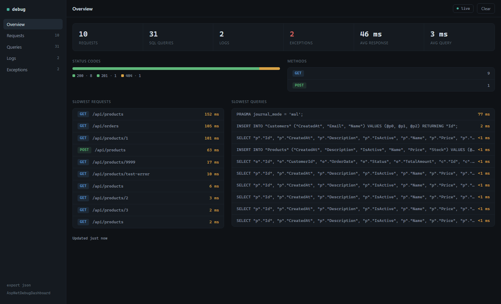
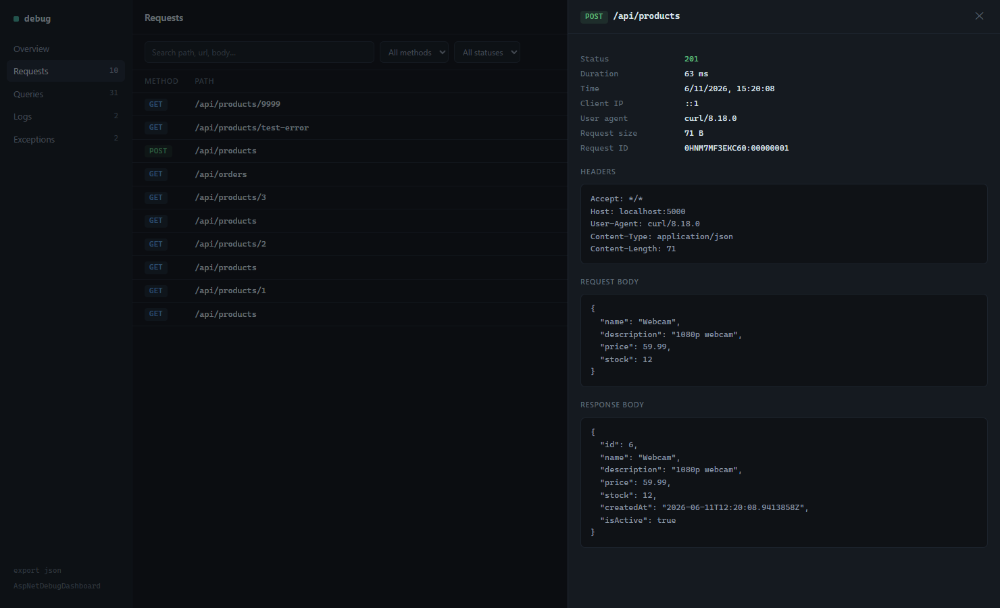

# ASP.NET Debug Dashboard

[](https://github.com/eladser/AspNetDebugDashboard/actions/workflows/ci.yml)
[](https://www.nuget.org/packages/AspNetDebugDashboard/)
[](LICENSE)

Request, SQL query, log, and exception capture for ASP.NET Core, viewable in a dashboard at `/_debug`. Think Laravel Telescope, but for .NET.

Everything is stored locally in a LiteDB file. The dashboard ships inside the package as a single self-contained page, so there are no CDN dependencies and it works offline.



## Install

```bash
dotnet add package AspNetDebugDashboard
```

Works on .NET 8, 9, and 10.

## Setup

```csharp
using AspNetDebugDashboard.Extensions;

var builder = WebApplication.CreateBuilder(args);

builder.Services.AddDebugDashboard();

var app = builder.Build();

app.UseDebugDashboard(); // no-op outside Development

app.MapControllers();
app.Run();
```

Run your app and open `/_debug`.

To capture EF Core queries, attach the interceptor when registering your context:

```csharp
builder.Services.AddDbContext<AppDbContext>((sp, options) =>
{
    options.UseSqlServer(connectionString);
    options.AddDebugDashboard(sp);
});
```

## What it captures

- **Requests** — method, path, status, timing, headers, request/response bodies, client info. Each request links to the SQL queries and logs it produced.
- **SQL queries** — full query text, parameters, execution time, row counts. Slow queries (default: over 1s) get flagged.
- **Exceptions** — type, message, stack trace, inner exceptions, the route that threw.
- **Logs** — written through `IDebugLogger`, with levels, categories, and structured properties.



## Writing logs

```csharp
public class OrderService(IDebugLogger log)
{
    public async Task<Order> CreateAsync(CreateOrderRequest req)
    {
        await log.LogInfoAsync("Creating order", properties: new() { ["customerId"] = req.CustomerId });
        // ...
    }
}
```

There's also a static `DebugLogger.InfoAsync(...)` for places where injection is awkward.

## Configuration

```csharp
builder.Services.AddDebugDashboard(options =>
{
    options.BasePath = "/_debug";            // dashboard route
    options.DatabasePath = "debug-dashboard.db";
    options.MaxEntries = 1000;               // per entry type, oldest trimmed first
    options.LogRequestBodies = true;
    options.LogResponseBodies = false;
    options.MaxBodySize = 1024 * 1024;       // bodies above this are skipped
    options.SlowQueryThresholdMs = 1000;
    options.ExcludedPaths = new() { "/_debug", "/health" };
    options.ExcludedHeaders = new() { "Authorization", "Cookie" };
    options.RetentionPeriod = TimeSpan.FromDays(7);
});
```

The full list is in [docs/CONFIGURATION.md](docs/CONFIGURATION.md).

## Production

`UseDebugDashboard()` does nothing unless the environment is Development, so leaving the package referenced in production builds is safe. If you do want it on elsewhere (a staging box, say), opt in explicitly:

```csharp
app.UseDebugDashboard(forceEnable: true);
```

If you force-enable it anywhere reachable from the internet, put it behind your own auth. The dashboard itself has none, and captured request bodies can contain anything your users send.

## REST API

The dashboard is a client of a plain JSON API you can also call directly: `/_debug/api/stats`, `/requests`, `/queries`, `/logs`, `/exceptions`, `/search`, `/export`, and more. See [docs/API.md](docs/API.md).

## How the dashboard is built

The UI is a Vite + React app in [dashboard/](dashboard/), compiled to one HTML file with everything inlined and embedded into the assembly. To work on it:

```bash
cd dashboard
npm install
npm run dev    # proxies /_debug/api to localhost:5000 — run the sample app alongside
npm run build  # writes src/AspNetDebugDashboard/wwwroot/index.html
```

The sample app in [samples/SampleApp](samples/SampleApp) has endpoints for generating traffic, slow operations, and test exceptions.

## License

MIT. See [LICENSE](LICENSE).
